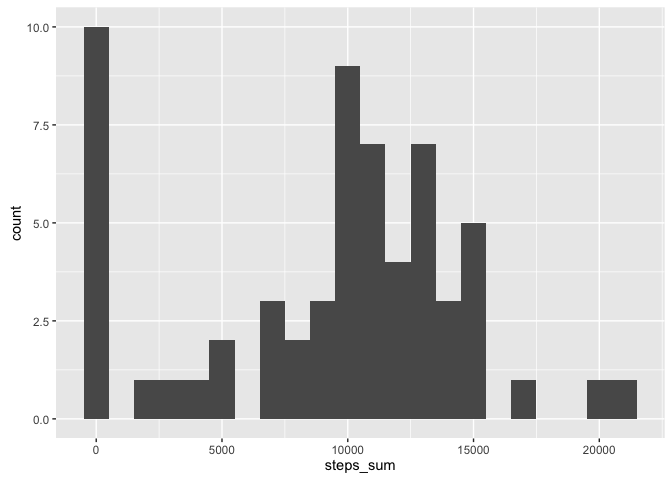
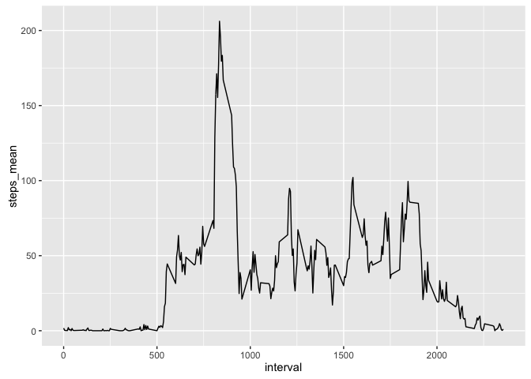
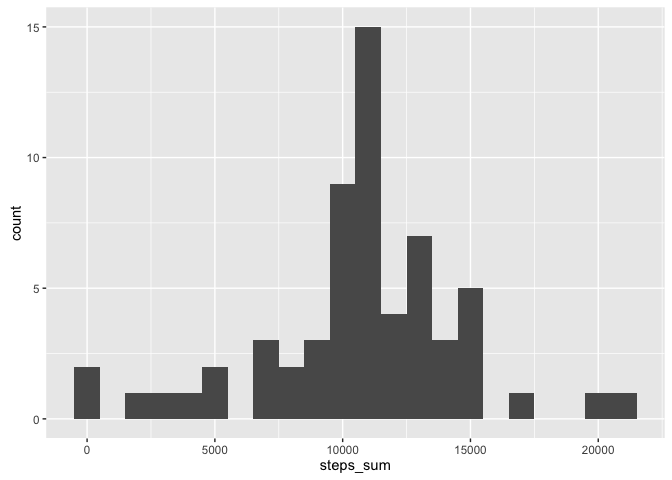
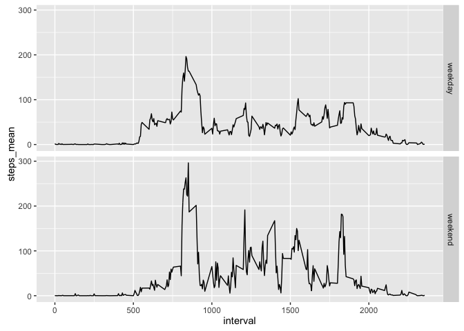

# Reproducible Research: Peer Assessment 1


## Loading and preprocessing the data

### Loading the data & necessary libraries

```r
library(lubridate)
```

```
## Warning: package 'lubridate' was built under R version 3.2.4
```

```
## 
## Attaching package: 'lubridate'
```

```
## The following object is masked from 'package:base':
## 
##     date
```

```r
library(dplyr)
```

```
## 
## Attaching package: 'dplyr'
```

```
## The following objects are masked from 'package:lubridate':
## 
##     intersect, setdiff, union
```

```
## The following objects are masked from 'package:stats':
## 
##     filter, lag
```

```
## The following objects are masked from 'package:base':
## 
##     intersect, setdiff, setequal, union
```

```r
library(ggplot2)
```

```
## Warning: package 'ggplot2' was built under R version 3.2.4
```

```r
act_data = read.csv("activity.csv")
```
## What is mean total number of steps taken per day?

### Histogram of total number of steps (NA data ignored)

```r
daily_avrg <- act_data %>%
    group_by(date) %>%
    select(steps) %>%
    summarize(steps_sum = sum(steps, na.rm=T))
ggplot(daily_avrg, aes(steps_sum))+
    geom_histogram(binwidth=1000)
```



### Mean and median of total number of steps 

```r
mean(daily_avrg$steps_sum)
```

```
## [1] 9354.23
```

```r
median(daily_avrg$steps_sum)
```

```
## [1] 10395
```

## What is the average daily activity pattern?

### Time series plot of daily activity (NA values ignored)

```r
interval_avrg <- act_data %>%
    group_by(interval) %>%
    select(steps) %>%
    summarize(steps_mean = mean(steps, na.rm=T))
ggplot(interval_avrg, aes(interval,steps_mean))+
    geom_line()
```



### Identifying the interval with the most steps


```r
interval <- which.max(interval_avrg$steps_mean)
max_steps <- max(interval_avrg$steps_mean)
```
The interval showing the highest number of steps is 104 with a maximum average of 206.1698113 steps.


## Imputing missing values

### Total number of missing values

```r
total_nas <- sum(is.na(act_data))
ratio_nas <- sum(is.na(act_data))/nrow(act_data)*100
```

A total of 2304 values are missing from the dataset, representing 13.1147541% of the data.

### Filling in the missing values
The missing values are replaced by the average of the corresponding time interval.

```r
impute.mean <- function(x){
    replace(x, is.na(x), mean(x, na.rm = TRUE))
}
act_imputed <- act_data %>%
    group_by(interval) %>%
    mutate(steps=impute.mean(steps)) %>%
    ungroup() 
```

### Histogram of the daily total steps
The histogram shows the density distribution of the total number of steps per day.

```r
act_imp_daily  <- act_imputed %>%
    group_by(date) %>%
    select(steps) %>%
    summarize(steps_sum = sum(steps))
ggplot(act_imp_daily, aes(steps_sum))+
    geom_histogram(binwidth=1000)
```



#### Compute the mean and median of total daily steps

```r
mean(act_imp_daily$steps_sum)
```

```
## [1] 10766.19
```

```r
median(act_imp_daily$steps_sum)
```

```
## [1] 10766.19
```

## Are there differences in activity patterns between weekdays and weekends?

### Factoring weekdays and weekends

```r
act_imputed$date <- ymd(act_imputed$date)
act_imputed <- act_imputed %>%
    ungroup() %>%
    mutate(
        week=factor(
            ifelse(wday(date) == 0 | wday(date) == 6,
                   'weekend','weekday')
        )
    ) %>%
    group_by(week, interval) %>%
    select(steps) %>%
    summarize(steps_mean = mean(steps))
```

### Panel plot showing weekdays and weekend patterns

```r
ggplot(act_imputed, aes(interval, steps_mean))+
    geom_line()+
    facet_grid(week ~ .)
```


